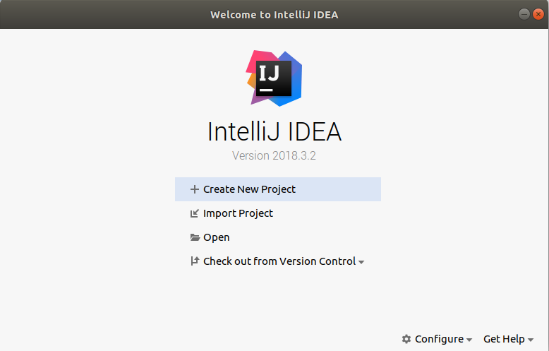

#  Bases de la programmation orientée objet 

### IUT Montpellier-Sète – Département Informatique

* **Cours:** [M2103](http://cache.media.enseignementsup-recherche.gouv.fr/file/25/09/7/PPN_INFORMATIQUE_256097.pdf) - support [ici](https://github.com/IUTInfoMontp-M2103/Ressources)
* **Enseignants:** [Marin Bougeret](mailto:marin.bougeret@umontpellier.fr), [Sébastien Gagné](mailto:sebastien.gagne@umontpellier.fr), [Jérôme Palaysi](mailto:jerome.palaysi@umontpellier.fr), [Victor Poupet](mailto:victor.poupet@umontpellier.fr), [Petru Valicov](mailto:petru.valicov@umontpellier.fr), [Bruno Yun](mailto:bruno.yun@umontpellier.fr) 
* Le [forum Piazza](https://piazza.com/class/jpv7gf0lltk4kc) de ce cours pour poser vos questions
* [Email](mailto:petru.valicov@umontpellier.fr) pour une question d'ordre privée concernant le cours.

## TP 2 : Prise en main de l'IDE et travail en mode TDD
Pendant les TP nous vous conseillons d'utiliser un environnement de développement intégré (IDE en anglais). Les avantages sont multiples : le refactoring du code, l'auto-complétion, la suggestion des méthodes/attributs/classes, la documentation intégrée, le debuggage, une bonne intégration de Git et GitHub, des tests unitaires etc. Dans ce cours nous utiliserons
**[IntelliJ IDEA](https://www.jetbrains.com/idea/)** de chez **[JetBrains](https://www.jetbrains.com)**. 
Il devrait donc vous faciliter la vie au quotidien dans la réalisation de vos TP. Bien évidement, rien ne vous empêche 
d'en utiliser un autre (Eclipse, NetBeans etc).

D'abord, et comme pour tous les tps de POO qui vont suivre, vous allez forker ce dépôt pour pouvoir commencer à travailler localement :

https://classroom.github.com/a/sOEtP2b1

### Découverte et prise en main de l'IDE

IntelliJ IDEA possède deux versions, la première dite *'communautaire'* est totalement open source et peut être utilisée 
gratuitement par n'importe qui et la seconde dite *'ultimate'* qui est plus riche en fonctionnalité et qui n'est pas 
gratuite pour les individus lambda. Par chance, comme dans le cas de GitHub, en tant qu'étudiant, vous avez la 
possibilité de pouvoir bénéficier d'une licence pour tous les produits JetBrains. Pour bénéficier de cette remise, il 
vous suffit de remplir [ce formulaire](https://www.jetbrains.com/shop/eform/students).

Quelques minutes après, vous recevrez un email de confirmation suivi d'un second email d'activation ou vous devrez accepter 
les conditions d'utilisation et choisir un nom d'utilisateur et un mot de passe. Conservez précieusement ces 
informations dans un coin identifié de votre cerveau car c'est grâce à elle que vous pourrez importer votre licence 
chez vous et dans les salles de TP.

#### Lancement de l'IDE

Ouvrir 'IntelliJ IDEA' (dans la section 'Programmation'/'Application').
Après le chargement, vous devriez tomber sur une première fenêtre vous proposant d'importer vos paramètres. Vous pouvez laisser sur 'Do not import settings' et valider :

À partir de là vous allez tomber sur la partie de personnalisation de votre installation pour qu'elle corresponde à vos besoins. Sur l'aspect esthétique, choisissez ce qui vous convient le mieux. En ce qui concerne les différents plugins à intégrer, à priori, les options installées par défaut sont suffisantes, donc vous choisirez l'installation par défaut.

À la fin, vous allez saisir vos données de connexion pour terminer le paramétrage de votre IDE.

**Import du projet dans l'IDE**
Pour pouvoir maintenant travailler sur votre TP, il vous faut cloner votre dépôt GitHub et l'importer dans l'IDE.

### Workflow

Maintenant que vous savez utiliser Git en ligne de commande, que vous avez forké, importé et ouvert le TP dans votre IDE, 
vous êtes en capacité de travailler sur vos exercices. Pour vous faire découvrir le Test Driven Development (TDD), nous 
allons vous proposer de suivre un workflow particulier pour résoudre vos exercices progressivement et en consolidant 
progressivement un filet de sécurité qui vérifiera que votre code continue à bien faire ce qu'il doit.

Le TDD (Test-driven development) est une méthode de développement de logiciels qui consiste
à travailler sur des cycles de développement très courts. La conception apparaît au fur et à mesure du développement en encourageant une meilleure compréhension du problème en commençant à écrire les tests avant le code 
applicatif. Pour le développeur, les tests vont constituer une spécification technique exécutable et vérifiable à tout 
moment. Ainsi en rajoutant des tests, le développeur converge progressivement à la fois vers une spécification plus fine 
et un code fonctionnel associé.

Ci-dessous le déroulement d’un cycle :
1. Écrire un premier test automatique qui est censé définir une nouvelle fonctionnalité. Le test
doit s’écrire avant la fonctionnalité voulue, il est donc censé échouer initialement (normal, car vous n'avez encore rien programmé).
2. Écrire le code minimal suffisant pour passer le test.
3. Vérifier que le test passe.
4. __Réfactoriser__ (simplifier, améliorer, optimiser etc.) tous le code tout en gardant la fonctionnalité. Durant cette étape les tests écrits préalablement sont exécutés en permanence pour certifier la validité des changements.

Ce workflow se décrit par le triptyque "RED, GREEN, REFACTOR" dans le schéma suivant :

Le workflow que vous allez devoir suivre va reprendre la même structure, mis à part qu'au début, les tests vous seront donnés pour vous faire découvrir cette méthode sans trop de douleur. Vous allez les activer un par un en commentant l'annotation `@Ignore`.

### Exercice 2 : Fizz Buzz !

Le kata Fizz Buzz est un des kata les plus connus pour l'apprentissage du TDD.
Une série 'FizzBuzz' de taille `n` est une suite d'entiers positifs où les multiples de 3 doivent être remplacés par 'Fizz' et les multiples de 5 doivent être remplacés par 'Buzz'. Voici la série FizzBuzz de taille 20 :

1 ; 2 ; Fizz ; 4 ; Buzz ; Fizz ; 7 ; 8 ; Fizz ; Buzz ; 11 ; Fizz ; 13 ; 14 ; FizzBuzz ; 16 ; 17 ; Fizz ; 19 ; Buzz

#### L'objectif de cet exercice est :
- Implémentez une classe `FizzBuzzer` avec une fonction `getValues(int i)` qui vous permettra de générer toute la série 'FizzBuzz' jusqu'à la valeur passée en paramètre. 

Vous activerez les tests les un après les autres et soumettre (avec un commit) votre solution après chaque itération du cycle principal du workflow.

### Exercice 4 : Calculette romaine

Vous êtes chargé de réaliser une calculette simplifiée qui effectue des additions et des soustractions des nombres écrits en numérotation romaine. Dans cette numérotation on utilise des caractères parmi sept lettres de l'alphabet latin : I, X, L, C, D et M. La signification en numérotation décimale classique est donnée ci-dessous :

| I | V | X  | L  |  C  |  D  |  M   |
|---|---|----|----|-----|-----|------|
| 1 | 5 | 10 | 50 | 100 | 500 | 1000 |

Un nombre romain se lit de gauche à droite en faisant des additions et des soustractions des valeurs des chiffres. Par exemple le nombre romain MLXIII correspond à 1063 dans la numérotation décimale car il se décompose comme M+L+X+I+I+I = 1000+50+10+1+1+1. Alors que le nombre XXXIV vaut 34 car il se décompose comme X+X+X+IV=10+10+10+4. Une meilleure façon de voir ce dernier exemple c'est d'utiliser la soustraction X+X+X-I+V=10+10+10-1+5.

Les nombres romains sont majoritairement représentés selon les principes suivants :
- Un même symbole n'est pas employé quatre fois de suite (sauf M) ;
- Tout symbole qui suit un symbole de valeur supérieure ou égale s’ajoute à celui-ci (exemple : 6 s'écrit VI) ;
- Tout symbole qui précède un symbole de valeur supérieure se soustrait à ce dernier ;
  * I doit être retranché à V ou à X quand I est devant V ou X}} (ex. : 4 s'écrit IV),

  * X doit être retranché à L ou à C quand X est devant L ou C (ex. : 40 s'écrit XL),

  * C doit être retranché à D ou à M quand C est devant D ou M (ex. : 900 s'écrit CM),

  * Par contre, ôter I de L ou de C n'est pas pratiqué (49 s'écrit XLIX et non IL ; 99 s'écrit XCIX et pas IC) ;

- Les symboles sont groupés par ordre décroissant, sauf pour les valeurs à retrancher selon la règle précédente (ex. : 1030 s'écrit MXXX et non XXXM qui est une des façons de représenter 970).
- CM, CD, XC, XL, IX, IV sont valides
- XM, IM, XD, ID, IC, IL sont non-valides

D'autres variantes de règles concernant la soustraction existent, vous pouvez choisir celles qui vous paraissent les plus pertinentes. Pour plus d'informations sur la numérotation romaine :

https://fr.wikipedia.org/wiki/Numération\_romaine

Faites très attention pour cet exercice de bien respecter le principe du TDD en ajoutant vraiment tout le temps la quantité minimale de code nécessaire à la validation des tests. Si vous suivez cette règle, il se résout très facilement alors qu'en l'abordant de manière générale, il comporte de nombreux pièges pouvant vous faire perdre un temps précieux.

Dans cet exercice, vous allez manipuler la classe [`String`](https://docs.oracle.com/javase/8/docs/api/?java/lang/String.html). Cette classe possède de nombreuses méthodes utilitaires pour manipuler facilement les chaines de caractères. Dans cette exercice, vous utiliserez principalement une boucle `for` et la méthode `charAt(i)` qui retourne le i-ème caractère d'une chaine.

**Convertisseur de nombres romains** 
Écrivez une classe Java appelée `RomanToNumeral`. Cette classe aura une méthode  `getNumeral()` qui prend un nombre romain en paramètre et retourne sa valeur en numérotation décimale (un type `int`). 

N'oubliez pas de faire des "commits" au fur et à mesure !

**Convertisseur de nombres décimaux** 
Écrivez une classe `NumeralToRoman` qui contiendra une méthode `getRoman()` qui prend un nombre entier en paramètre et retourne sa valeur en numérotation romaine (de type `String` donc).

Est-ce que vos tests sont suffisant ? Que se passe-t-il lors de la conversion `romain` -> `décimal` -> `romain` ?

**Additionneur romain**
En utilisant les deux classes écrites précédemment, créez une classe `RomanAdditionner` qui contiendra une méthode `compute()`. Cette méthode prendra en paramètre une chaîne de caractères représentant une expression arithmétique romaine telle que :

 - les opérandes sont écrits en numérotation romaine
 - les opérations possibles sont `+` et `-`

Voici un exemple d'expression arithmétique : MMMXL + XII - CIX.

Le résultat correspondant devrait être : MMCMXLIII.

Vous trouverez d'autres katas qui vous permettront de mieux apprendre la programmation en mode TDD :

http://codingdojo.org/kata/
